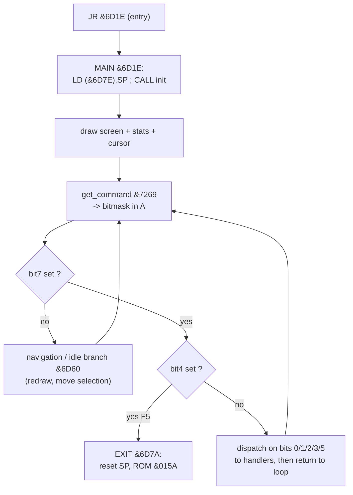

# DISK ARCHIVE v2.0 — SAM Coupe disk archiver

Reverse-engineering notes for `ARCHIV.BIN`. Companion to the byte-exact
disassembly [`ARCHIV.asm`](./ARCHIV.asm).

> **Status: first pass.** Load address, structure, the menu/dispatch, all text
> and the font are identified and the disassembly reassembles byte-exact. Deep
> per-routine annotation (especially the compression internals) is ongoing.

---

## 1. Identification

| Property      | Value                                                              |
|---------------|--------------------------------------------------------------------|
| Name          | **DISK ARCHIVE**, version 2.0 (RUMSOFT ARCHIVE SYSTEM 2.0)          |
| Author        | **Marian Krivoš** (RUMSOFT), 1993 — Nábrežie …, 031 01 L. Mikuláš, Slovakia |
| Platform      | SAM Coupe (Z80, paged memory)                                      |
| File size     | 5900 bytes (`&170C`)                                               |
| Load address  | **`&6D00`**                                                        |
| Entry         | `&6D00` → `JR &6D1E` (skips a small data header)                    |
| Signatures    | "DISK ARCHIVE  Version 2.0  Copyright 1993 RUMSOFT"                 |

Load address confirmed by the entry instruction `LD (&6D7E),SP` (a self-store
into the module's own variable area) and by the clustering of all call/jump
targets in `&6D00..&7Fxx`.

---

## 2. Memory map

| Range          | Contents                                                          |
|----------------|-------------------------------------------------------------------|
| `&6D00`        | `JR &6D1E` — entry                                                 |
| `&6D02..&6D0E` | small data header (`64 64` + zeros; `&6D04` is a state flag)       |
| `&6D0F..&6D1D` | `set_border` — `OUT (&FE),&27`                                     |
| `&6D1E..`      | **MAIN** + command handlers + helper routines (code)              |
| inline         | UI/strings printed via `CALL &734D` + text + `&FF` (see §5)        |
| `&734D`,`&73AB`| `print_inline` / `print_str`                                      |
| `&7F77..&7FFF` | credits text block                                                |
| `&8000..&840B` | **8×8 font**, 8 bytes/char starting at ASCII space                |

---

## 3. Interface (user-facing, per `arch-pack_utils_info.txt`)

Menu-driven; function keys:

| Key | Label    | Action                                  |
|-----|----------|-----------------------------------------|
| F1  | SCAN     | read the disk directory                 |
| F2  | LINK     | load the selected files into memory     |
| F3  | COMPRESS | compress the loaded files               |
| F4  | STORE    | save the archive                        |
| F5  | EXIT     | leave the program                       |
| F6  | ALL      | select all files                        |

COMPRESS options (prompted on screen): **Mode** (1 = shrink, 2 = implode,
3 = both), **Speed** (0 = best ratio … 7 = fastest), **Skip**. Confirmations:
"DO YOU WANT COMPRESS … (Y/N)", "SAVE THIS FILE … (Y/N)".

Status line: "FILES:   SELECTED:   FREE:   DISK USES:". Errors: "Check disk",
"Pack error", "Disk error !", "BAD CHECKSUM", "Put DESTINATION disk".

---

## 4. Architecture — main loop & dispatch

`get_command` (`&7269` → `scan_keys &727C`) scans the keyboard and returns a
bitmask in `A`. `scan_keys` reads two key rows on data port `&F9` (row selected
by the high address byte `B = &FE` / `&FD`), takes 3 keys from each and packs
them as bits 0..5; bit7 = "a key is down". The main loop dispatches on the bit.

The F-key → bit mapping is **confirmed**: keys map F1..F6 → bits 0..5, anchored
by F5 EXIT = bit4 (verified independently from the exit handler).

| Bit | Key / handler        | Role                                              |
|-----|----------------------|---------------------------------------------------|
| 0   | F1 SCAN → `&71DA`     | read the disk directory                           |
| 1   | F2 LINK → `&7232`     | load the selected files into memory               |
| 2   | F3 COMPRESS → `&77C5` | compress loaded files (Mode/Speed/Skip)           |
| 3   | F4 STORE → `&7016`    | save archive (prompts "Enter file name:")         |
| 4   | F5 EXIT → `&6D7A`     | reset SP, ROM `&015A` *(confirmed anchor)*        |
| 5   | F6 ALL → `&6EA9`      | select all files                                  |
| 7=0 | nav → `&6D60`         | navigation / idle (cursor move, redraw)           |

---

## 5. Text output convention

Strings are printed **inline**: `CALL print_inline (&734D)` immediately followed
by the bytes of the string, terminated by `&FF`. The string may embed control
codes (e.g. `&16 row col` = position/AT). Internally `&734D` does
`EX (SP),HL` / `CALL &73AB` / `EX (SP),HL` / `RET`, so the inline text is read
via the return address and execution resumes just after the `&FF`.

`ARCHIV.blk` marks every detected inline string as `bytedata` so the listing
stays aligned. `print_str` (`&73AB`) is the inner loop that prints `(HL)` until
`&FF`.

---

## 6. Known routines

| Address | Name           | Role                                             |
|---------|----------------|--------------------------------------------------|
| `&6D0F` | `set_border`   | `OUT (&FE),&27`                                  |
| `&6D1E` | `main`         | entry / menu loop                                |
| `&717C` | `init`         | one-time initialisation                          |
| `&6D88` | —              | draw / refresh main screen *(inferred)*          |
| `&7201` | —              | update file list / stats *(inferred)*            |
| `&710C` | —              | cursor / highlight *(inferred)*                  |
| `&7269` | `get_command`  | read key → bitmask in A (via `scan_keys`)        |
| `&727C` | `scan_keys`    | scan F-key rows → 6-bit mask (bit7 = pressed)    |
| `&714E` | —              | prepare/clear work area *(inferred)*             |
| `&734D` | `print_inline` | print following inline `&FF`-terminated string   |
| `&73AB` | `print_str`    | print string at `(HL)` until `&FF`               |
| `&71DA` | `f1_scan`      | F1 SCAN — read disk directory                    |
| `&7232` | `f2_link`      | F2 LINK — load selected files                    |
| `&77C5` | `f3_compress`  | F3 COMPRESS — compress loaded files              |
| `&7016` | `f4_store`     | F4 STORE — save archive                          |
| `&6EA9` | `f6_all`       | F6 ALL — select all files                        |
| `&6D7A` | (F5 EXIT)      | reset SP, ROM `&015A`                            |

---

## 7. Font

A built-in **8×8 pixel font** lives at `&8000..&840B` (≈129 glyphs, 8 bytes
each, indexed from ASCII space `&20`). Example — `&8018` is `0`:
`3C 66 6E 76 66 66 3C` (the classic slashed-zero shape).

---

## 8. Next steps

1. ~~Trace `scan_keys` to map F1–F6 to the command bits.~~ **Done** — F1..F6 = bits 0..5.
2. ~~Label the handlers SCAN / LINK / COMPRESS / STORE / ALL.~~ **Done** (`f1_scan` … `f6_all`).
3. Annotate the *bodies* of the handlers (file I/O, selection logic).
4. ~~Reverse the **compression** (Mode 1 shrink / 2 implode / 3 both).~~ **Done**
   — the engine is shared with `IMPLO1.BIN`: SHRINK = RLE, IMPLODE = LZ77.
   See [`IMPLO1.md`](./IMPLO1.md). (`f3_compress &77C5` mirrors that driver.)
   Remaining: disk I/O and `UNPAK.BIN`.
5. Convert font/credits/string blocks to friendlier `defm`/`defb` groupings.
6. Produce the Slovak translation `ARCHIV.sk.md` once the content stabilises.

---

*Disassembled with z80dasm 1.1.6; byte-exact (`make NAME=ARCHIV verify`).*
