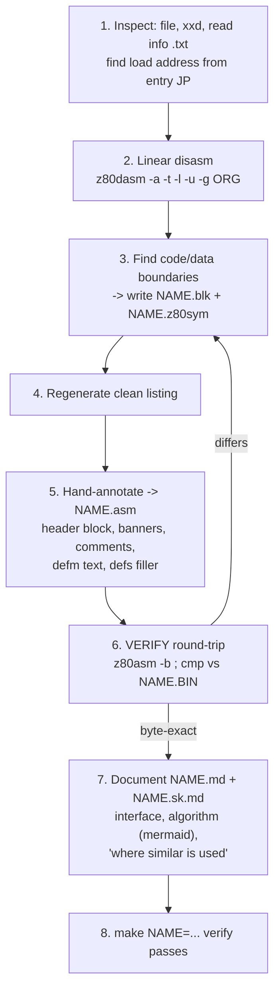

# CLAUDE.md — SAM Coupe arch-pack utilities (reverse engineering)

Project memory for `/home/data/sam/DISAS/ArchPackUtils/`.
Read this before working on any binary here.

---

## 1. What this is

A set of **SAM Coupe** (Z80, paged memory) utilities for file
compression / archiving, originating from `arch-pack_utils.mgt` (an MGT disk
image). We are **reverse-engineering** these Z80 binaries one by one: producing a
byte-exact annotated disassembly plus human documentation for each.

Reference docs shipped with the package:
- `arch-pack_utils_info.txt` — user-level description of every tool (ARCHIV,
  UNPAK, IMPLODER, SCREENCOM1, LIB, PASS).
- `arch-pack_utils_note.txt` — author notes.
- `UTILS.TXT` — extra notes.

Always read the matching section of `arch-pack_utils_info.txt` first — it tells
you what a tool is *supposed* to do before you read the code.

---

## 2. Toolchain

| Tool        | Purpose                                  | Notes                                  |
|-------------|------------------------------------------|----------------------------------------|
| `z80dasm`   | Disassembler (1.1.6)                      | block-def + symbol files supported     |
| `z80asm`    | Assembler (z88dk / InterLogic)           | `-b` = build .bin; output `-o=FILE` (needs `=`) |
| `make`      | Drives assemble + **verify** round-trip  | generic via `NAME=` (see `Makefile`)   |
| `ghidra`    | Decompiler to pseudo-C (12.1, **has a Z80 module**) | *complementary aid*, see below |

**Helper scripts (project-local, reusable):**

| Script             | Purpose                                                            |
|--------------------|-------------------------------------------------------------------|
| `loadaddr.py`      | Guess ORG: entry vector + self-store + call-target clustering (§7.1) |
| `ngram_dup.py`     | Shared-code % between two binaries via 16-grams (§7.8)             |
| `strip_listing.py` | Drop auto address+hex from `.asm` comments, keep prose (§7.11)     |
| `sambas2txt.py`    | Detokenise SAM BASIC → ASCII listing (§7.9)                        |
| `ghidra_decompile.java` | Headless Ghidra post-script → `NAME.ghidra.c` (§7.10)         |

### Ghidra (complementary)

Ghidra 12.1 is installed (`/opt/ghidra`) and ships a Z80 SLEIGH module
(`z80:LE:16:default`). `make NAME=X ORG=0xBASE ghidra` runs it headless
(`ghidra_decompile.java`) and writes pseudo-C to `X.ghidra.c`. It is great for
quickly grasping control/data flow and bit math in big routines, and it confirmed
the SKOMP/ARCHIV analyses. **Limits (be honest):** the Z80 decompiler does NOT
model shadow registers (`EXX`/`EX AF,AF'`) or self-modifying code, and ROM calls
(`&00xx`) show as `func_0xXXXX` (ROM not loaded). So treat `.ghidra.c` as a
reading aid only — the **canonical, verified deliverable stays the byte-exact
`.asm`** (z80dasm + z80asm round-trip). Cross-check anything Ghidra claims in the
`.asm`.

`z80asm` quirks: options use `-o=FILE` (with `=`), not `-o FILE`. `-b` assembles
and links to `NAME.bin`; it also emits `NAME.o`. Directives `defb`, `defw`,
`defm`, `defs n,fill`, `equ`, `org` all work.

`z80dasm` invocation we standardize on:
```
z80dasm -a -t -l -u -g <ORG> -b <NAME>.blk -S <NAME>.z80sym <NAME>.BIN -o <NAME>.gen.asm
```
`-a` addresses, `-t` source bytes, `-l` auto labels, `-u` undocumented opcodes
inline, `-g` origin, `-b` block-def file, `-S` symbol input file.

---

## 3. SAM Coupe technical reference (recurring facts)

- **Z80**, 64 KB address space split into four 16 KB **sections** A/B/C/D
  (`&0000 / &4000 / &8000 / &C000`), each mapped to a RAM/ROM **page**.
- **Paging ports:**
  - `&FA` **LMPR** (Low Memory Page Register) — sections A/B (`&0000..&7FFF`).
  - `&FB` **HMPR** (High Memory Page Register) — sections C/D (`&8000..&FFFF`).
  - `&FC` **VMPR** (Video Memory Page Register) — selects the video page.
  - `&FE` keyboard / border.
- **Address ↔ (page, offset):** `page = (addr - base) / 16384`,
  `offset = ((addr) & 0x3FFF) | 0x8000` (offset normalized into section C). See
  the `&400C..&4046` block of `SKOMP1.asm` for the canonical conversion idiom
  (`sbc hl,de` / `rlc h`+`rla` / `srl h` / `set 7,h`).
- **Reading the screen:** `in a,(&FC)` (VMPR) `; and &1F ; out (&FB),a` pages the
  video page into section C, so screen bytes appear at `&8000`.
- **ROM** is paged at `&0000`; `CALL`s into low addresses (`&0004`, `&005C`,
  `&012D`, `&015A`, …) are ROM routines.
- **Load address:** infer from the entry `JP`/`JR` at file offset 0
  (`base = entry_target - file_offset_of_target`; for a header+code layout the
  target lands just past the header). Cross-check against the corresponding full
  **SAM CODE file** (the plain-named files like `ARCHIV`, `IMPLODER`, `UNPAK`
  start with a SAM file header that encodes load address & length); the `*.BIN`
  files are the stripped code bodies.

---

## 4. Workflow: analyze + document one routine

This is the repeatable recipe. Use the same output file names every time.
**The round-trip verification (step 6) is mandatory — never claim a disassembly
is correct without it.**



1. **Inspect.** `file NAME.BIN`, `xxd NAME.BIN | head`, read the relevant part
   of `arch-pack_utils_info.txt`. Decode the entry `JP`/`JR` to get the load
   address.
2. **Linear disassembly.** Run `z80dasm` with `-a -t -l -u -g <ORG>` to a scratch
   file. Read it end to end. Expect "self modifying code" warnings — normal here.
3. **Boundaries.** Identify text/data/table regions. Write:
   - `NAME.blk` — block-def: `label: start 0xXXXX end 0xYYYY type bytedata`
     (end = last+1). Types: `code`, `bytedata`, `worddata`, `pointers`.
   - `NAME.z80sym` — symbol input: `SYMBOL: equ 0xADDR ; comment` for ports, ROM
     routines, system vars, named routines, header fields.
4. **Regenerate** the clean listing with `-b NAME.blk -S NAME.z80sym`.
5. **Annotate → `NAME.asm`** (English comments):
   - Top **documentation header** (purpose, load addr, entry, memory map,
     algorithm summary, SAM ports used).
   - **Section banners** (`;===`) before MAIN and each routine.
   - **Inline comments** explaining intent, register roles, paging, self-mod
     patch points (note the run-time `&8000`-based address for relocated code).
   - Convert text runs to `defm "..."`; collapse filler/zero tables to
     `defs n, value`.
   - **Strip the auto address+hex from comments** once annotation is done — final
     listings keep ONLY explanatory prose, never per-instruction addresses or
     opcode bytes (standing rule). Run `python3 strip_listing.py NAME.asm`.
     Comments don't affect bytes, so this is byte-safe (re-verify with `make`).
     The documentation header's `&XXXX` memory map is intentional and stays.
6. **Verify (mandatory).** `z80asm -b -o=NAME.bin NAME.asm` then
   `cmp NAME.bin NAME.BIN`. Must be **byte-exact**. If not, fix step 3/5 and
   repeat. `make NAME=... verify` does this.
7. **Document.** Write `NAME.md` (English) and `NAME.sk.md` (Slovak translation).
   Include: identification, memory map, **interface** (inputs/outputs/ports/
   calling convention), **compression/decompression algorithm** with Mermaid
   diagrams, and a chapter on **the algorithm class & where similar is used**.
8. **Confirm** `make NAME=... verify` passes; list the produced files.

---

## 5. Output file conventions (per routine `NAME`)

| File            | Content                                                        |
|-----------------|---------------------------------------------------------------|
| `NAME.BIN`      | Original binary (input, do not modify).                        |
| `NAME.asm`      | Hand-annotated, byte-exact disassembly (English comments).     |
| `NAME.blk`      | z80dasm block-def file.                                        |
| `NAME.z80sym`   | z80dasm symbol input file.                                     |
| `NAME.md`       | English documentation (interface + algorithm + Mermaid).      |
| `NAME.sk.md`    | Slovak translation of `NAME.md`.                               |
| `NAME.bin`      | Build output (lowercase) — git-ignored / `make clean`.        |
| `NAME.gen.asm`  | Raw regenerated listing (reference) — `make clean`.            |

Shared: one generic `Makefile` (`NAME=` selects the routine, default `SKOMP1`).

---

## 6. Conventions

- **Code comments: English.** User-facing docs: **English (`.md`) + Slovak
  (`.sk.md`)**. (Chat with the user is in Slovak.)
- In `NAME.asm`, after cleanup, comments hold **only explanatory text** — no
  addresses, no hex byte dumps.
- Addresses use the SAM convention `&XXXX` in prose/comments; `0xXXXX` / `XXh`
  in assembler operands as z80dasm emits them.
- **Mermaid:** quote every node label `["..."]` / `{"..."}`; avoid parentheses
  in edge labels (use `-->|simple label|`); keep `&XXXX` without trailing `;`.
- Keep identifiers and instruction mnemonics in original form (don't translate
  `COMPRESS`, `LMPR`, `LDIR`, register names, etc.).
- Z80 has no meaningful C "decompilation"; the deliverable is an annotated
  assembly + prose, not pseudo-C.

---

## 7. Tactics & techniques cookbook

Hard-won heuristics from the binaries already done. Organised **problem →
technique** so the next routine goes faster. Two ad-hoc Python helpers are now
saved as reusable tools: `loadaddr.py` and `ngram_dup.py`.

### 7.1 Find the load (ORG) address — three cross-checks

Never guess; corroborate at least two of these (`python3 loadaddr.py NAME.BIN`
runs all three):

1. **Entry vector.** Decode the `JP`/`JR` at file offset 0. For a header+code
   layout the target lands just past the header, so `ORG = target − offset`.
   (SKOMP1: `JP &400C` ⇒ &4000; CrunchCode: `JP &800E` ⇒ &8000.)
2. **Self-store.** `LD (nnnn),SP` (`ED 73`) or `LD (nnnn),HL` (`22`) near an
   entry stores an address *inside the loaded image* — the ORG sits just below
   it. This is the strongest signal: CrunchCode's `LD (&800C),SP` nails &8000;
   ARCHIV's `LD (&6D7E),SP` nails &6D00.
3. **Call-target clustering.** For each candidate ORG, count how many absolute
   `CALL`/`JP` operands land in `[ORG, ORG+len)`. The maximising ORG wins
   (SKOMP1 62 %, CrunchCode 72 % of non-ROM targets). ROM calls (`<&4000`) are
   noise — exclude them from the score.

Then confirm against the full **SAM CODE file** header (the plain-named twins
`ARCHIV`, `IMPLODER`, … carry a header encoding load addr + length).

### 7.2 Map entry vectors & calling convention first

Packers/crunchers expose a small **JP table at the load address** (CrunchCode:
3 vectors crunch/decrunch/decrunch+port). Each entry's prologue tells you the
ABI: `DI` + save `SP` + `SP=0` ⇒ runs with no stack/interrupts, restores
`LMPR`/`SP` + `EI; RET` on exit. Identify pack vs unpack here, but **confirm
the direction by reading which one consumes vs produces the bitstream** (see
7.4) — labels are easy to get backwards (the CrunchCode pack/unpack mislabel).

### 7.3 Code/data boundaries

Read the linear disasm end to end once. Mark: FF-/0x0D-terminated text → `defm`;
zero/constant fills → `defs n,val`; jump/pointer tables → `pointers`/`worddata`;
frequency/rank/lookup tables (e.g. CrunchCode `&8400`, `&8600`, `&9C41`) →
`bytedata`. Encode all of it in `NAME.blk` so the regenerated listing is clean.

### 7.4 The decoder is the spec (most important RE rule)

To recover an **exact compression format, read the depacker, not the packer.**
The decoder is smaller, fully deterministic, and unambiguously defines every
token — the packer often has heuristics/fallbacks that obscure the format. This
is how IMPLODE (`implode_fin` backward decode), SHRINK (PackBits control byte),
and CrunchCode (`bit_read &82FD` 2-bit class) were all pinned down exactly.
Bonus: the decoder reveals bit order (LSB/MSB-first), refill cadence, and
end-of-stream marker for free.

### 7.5 Recognise the algorithm class from signature opcodes

| You see in the code…                                   | Algorithm class            |
|--------------------------------------------------------|----------------------------|
| `CPIR`/`CPDR` scanning a sliding window, emit (len,dist)| **LZ77/LZSS** (IMPLODE)    |
| compare to *previous* byte, count equal run            | **RLE** (SKOMP, SHRINK)    |
| control byte `count=(B&0x7F)+1`, bit7 = repeat/literal | **PackBits RLE** (SHRINK)  |
| histogram of byte freqs + **sort** + variable-bit emit | **entropy/Huffman-ish** (CrunchCode) |
| flag byte every 8 tokens, bit = literal/copy           | **LZSS framing** (SKOMP)   |

A histogram pass (`&81CB`) followed by a sort (`build_ranktab`) is the
fingerprint of a *statistical* coder — the only class that beats RLE/LZ on
skewed data (text), which doubles as a sanity check on the C++ port's ratios.

### 7.6 Self-modifying & relocating code

Expect z80dasm "self modifying code" warnings — normal. When code **relocates**
(DEC copies &8000→&4000 then runs), annotate **both** addresses: load-time and
run-time. Patch points written by `LD (addr),A`/`LD (addr),HL` are parameter
slots — name them in the `.z80sym` (e.g. COMPRES params at `&A00D`). The BASIC
wrapper's POKEs (see 7.9) reveal which slots are user-tunable.

### 7.7 Inline strings after CALL

UI text is emitted as a `CALL print_inline` immediately followed by the string
bytes terminated by `&FF` (ARCHIV `&734D`) or another sentinel. The return
address *is* the string pointer; the routine skips past the terminator. Detect
these in `.blk` so the string becomes `defm` instead of bogus instructions.

### 7.8 Duplicate vs distinct code — don't re-analyse a copy

Before deep-diving a second engine, run `python3 ngram_dup.py A B` (16-byte
n-grams, alignment- and ORG-independent). Jaccard ~0 % ⇒ independent, analyse it
(DEC vs COMPRES = 0.1 %, so both were worth doing). >40 % ⇒ it's a copy/
relocation — analyse once and record the alias. This turns "are these the same?"
into a 1-second check instead of a manual diff.

### 7.9 SAM BASIC wrappers expose the machine-code ABI

The tokenised BASIC loader (`python3 sambas2txt.py FILE FILE.bas`) is a free
spec for the Z80 blob it drives: `LOAD "x" CODE addr` gives the load address,
`POKE`s before `USR addr` give the parameter block layout and entry point, and
`SAVE` lines show the output framing. LIB's `PROC compr` revealed COMPRES's
param offsets, the `USR` entry, and the prepended 367-byte DEC stub — engine
ownership solved without guessing.

### 7.10 Ghidra: fast control-flow sketch, never the deliverable

`make NAME=X ORG=0xBASE ghidra` → `X.ghidra.c`. Good for big-routine bit math
and loop structure. **Blind spots:** no shadow regs (`EXX`/`EX AF,AF'`), no
self-modifying code, ROM calls show as `func_0xXXXX`. Every Ghidra claim must be
re-confirmed in the byte-exact `.asm` — which stays the canonical output.

### 7.11 Verification & comment hygiene (non-negotiable)

`z80asm -b -o=NAME.bin NAME.asm && cmp NAME.bin NAME.BIN` must be byte-exact
before the `.asm` is "done" — comments are free (don't affect bytes), so annotate
freely then `python3 strip_listing.py NAME.asm` to drop auto address+hex from
comments and re-verify. A filename with a space (`UNPAK .BIN`) or no `.BIN`
extension (`DEC`, `COMPRES`) bypasses the `NAME=` Makefile — assemble/`cmp`
directly with an explicit `ORG=`.

### 7.12 C++ codec port strategy

Port the **format from the decoder (7.4)**, not a guess. Match the on-wire
fields exactly (token markers, class prefixes, bit order); a clean equivalent
container/header around them is fine — state plainly that byte-identical
reproduction of the *original tool's* output isn't claimed unless you replicated
its exact in-memory framing. Always ship a `t` self-test covering: empty, single
byte, long run, skewed (text), random (worst case / expansion), and
domain-shaped (screen) inputs — the ratios double as an algorithm-class check.

---

## 8. Status / inventory

Reverse-engineering targets (the `*.BIN` code bodies). Load addresses inferred
from the entry `JP` — confirm per binary.

| Binary        | Entry        | ~Load  | Tool / purpose                  | Status |
|---------------|--------------|--------|---------------------------------|--------|
| `SKOMP1.BIN`  | `JP &400C`   | &4000  | Screen compressor (RUMSOFT)     | **DONE** — `.asm/.md/.sk.md` |
| `ARCHIV.BIN`  | `JR &6D1E`   | &6D00  | DISK ARCHIVE v2.0 (menu archiver, M. Krivos) | **byte-exact .asm** (blk/sym/doc); deep annotation WIP |
| `IMPLO1.BIN`  | `JP &43FB`   | &4000  | TURBO IMPLODER V1.0 (RUMSOFT & SAPOSOFT) | **byte-exact .asm** + algorithm doc (`IMPLO1.md`); deep annotation WIP |
| `UNPAK .BIN`  | `JP &414D`   | &4100  | UNPACK ARCHIVE 2.0 (inverse of ARCHIV) | **byte-exact .asm** + `UNPAK.md`; decode loop WIP |
| `DEC`         | (relocator)  | &8000  | LIB's self-relocating depacker stub (367 B; prepended to compressed files) | **byte-exact `DEC.asm`** |
| `COMPRES`     | `JP &A023`   | &A000  | LIB's compressor engine (core @ &A550; params @ &A00D) | **byte-exact `COMPRES.asm`** |
| `Lib v21`     | SAM BASIC    | —      | "Library" v2.1 file librarian (S. Grodkowski); drives COMPRES+DEC | **`Lib v21.bas`** + `LIB.md` |
| `PASS`        | SAM BASIC    | —      | password-garbler loader (drives `PASS1` code) | **`PASS.bas`** (detokenised) |
| `PASS1`       | `DI …`       | ?      | the password-garbler Z80 routine (86 B) | TODO (tiny) |
| `SCREENCOM1`  | SAM BASIC    | —      | screen-compressor loader (drives `SKOMP1`) | **`SCREENCOM1.bas`** (detokenised) |
| `CrunchCode`  | `JP &800E…`  | &8000  | **foreign** cruncher (unknown author, unrelated) — RLE + frequency-rank entropy code | **byte-exact `CrunchCode.asm`** + `CrunchCode.md` |

**`CrunchCode` is third-party** (0% shared code with any RUMSOFT/SAPOSOFT tool).
Load &8000; entries **crunch (pack) &800E / decrunch (depack) &8025 /
decrunch+OTDR-to-port-&F8 &803F**. Algorithm = **RLE pre-pass + static
frequency-rank entropy code** (NOT LZ): `histogram &81CB`, `find_escape &81F1`,
`build_ranktab &8212` (bytes sorted by frequency, ≤84, → &9C41); `emit_codes
&814C` writes a 2-bit-class prefix code (class 0/1/2 = rank 0-3 / 4-19 / 20-83 via
2/4/6 index bits; class 3 = 8-bit raw escape). `decrunch_core &8256` (`bit_read
&82FD`) is the inverse. Exact format in `CrunchCode.md §3.1`; portable C++ codec
pair in `cpp/crunch_codec.*` (+ `./crunch t`). It is the only entropy coder of the
set (wins on skewed data, e.g. ~70% on text). All four C++ codecs (skomp/implode/
shrink/crunch) build via `cpp/CMakeLists.txt`.

**Authorship / engine ownership:** `COMPRES` + `DEC` are **LIB's** engines
(S. Grodkowski / SAPOSOFT), confirmed by `Lib v21.bas` PROC `compr`: it POKEs
COMPRES's params at `&7600D…&76015` (=`&A00D`), calls `USR &76000`, then prepends
the 367-byte `DEC` stub (`MEM$ &77000 TO …+366`) and patches `&77057/&77058`.
They are NOT the RUMSOFT `ARCHIV`/`IMPLODER` engine (that one is shrink/implode in
`IMPLO1.asm`). The IMPLODER's "RUMSOFT & SAPOSOFT" credit = the SAPOSOFT half is
this compression pair.

Confirmed **not byte-identical** to any earlier tool (0% shared 16-grams) — both
are distinct implementations, so they were worth doing.

**UNPAK has no inline decompressor** (only 2× `LDIR`, no `CPIR`/`LDDR`): it is a
UI + disk-I/O extractor that writes archive entries as **self-extracting** files;
decompression is deferred to run time via each file's embedded depacker (the
DEC family). This closes the pack→store→extract→self-unpack chain.

### SAM BASIC wrappers

`PASS`, `SCREENCOM1` (and the full-file `ARCHIV`/`IMPLODER`/`UNPAK`/`Lib v21`)
are **tokenised SAM BASIC** programs, not Z80 code. Format: per line
`[line# BE16][len LE16][body…0x0D]`; inline numbers = ASCII digits + `0x0E` + 5
bytes; functions/operators = `0xFF`+token (0x3B–0x83); commands/qualifiers =
direct bytes 0x85–0xFE. Detokenise with **`python3 sambas2txt.py FILE FILE.bas`**
(self-contained; token table baked in from the SAM ROM source). One-way listing,
not byte-reversible. Tokens 0x21–0x3A are **MasterDOS** extensions → `{FN_xx}`.

* `PASS.bas` — password-garbler loader: `LOAD "PASS1" CODE` (the actual Z80
  routine), input password, `CALL` it, `SAVE`. `PASS1` is machine code (DI…).
* `SCREENCOM1.bas` — screen-compressor loader; line 150 does
  `LOAD "sKomp1.bin" CODE 16384: RUN` → it drives **SKOMP1**.

**File-name caveat:** `UNPAK .BIN` has a space, so the `NAME=` Makefile targets
don't fit it; assemble/verify it directly:
`z80asm -b -o=/tmp/u.bin UNPAK.asm && cmp /tmp/u.bin "UNPAK .BIN"`.
`DEC` and `COMPRES` have no `.BIN` extension and load high (&4000 / &A000) — pass
`ORG=` and use direct `z80dasm`/`z80asm` invocations rather than `NAME=`.

Compression engine (shared by `IMPLO1.BIN` and `ARCHIV.BIN` F3): **SHRINK** =
RLE (runs of ≥4 equal bytes; `shrink_scan &4665`), **IMPLODE** = LZ77/LZSS
(CPIR longest-match in a &0821-byte window; `implode_core &483E`). Mode `'1'/'2'/
'3'` selects shrink / implode / both (tested bitwise). Output is a self-extracting
`.PAK` (header at &4B00, embedded depacker) — same stub technique as SKOMP1.

**Exact IMPLODE LZ77 token format** (from the depacker `implode_fin`, which
decodes backward in place): `0x03` = match marker; literal = any other byte;
`0x03,0x00` = escaped literal `0x03`; match = `0x03, mid, dist_lo` with
`mid=((len-2)<<3)|dist_hi`, `len=(mid>>3)+2` (3..33), `dist=((dist_hi<<8)|dist_lo)+1`
(1..2048). Documented in `IMPLO1.md §6a` with Mermaid; portable C++ encoder+decoder
in `cpp/implode_codec.*` (+ `./implode t` self-test). SKOMP RLE C++ is `cpp/skomp_codec.*`.
**SHRINK** (PackBits RLE: control `count=(B&0x7F)+1`, bit7=repeat/literal; format
in `IMPLO1.md §3.1`) C++ pair is `cpp/shrink_codec.*` (+ `./shrink t`). All three
codecs build via `cpp/CMakeLists.txt`; Mode 3 = shrink then implode (cascade).

ARCHIV.BIN is by **Marian Krivos** (RUMSOFT, 1993) — the author of this repo's
owner; its credits string names him. Load &6D00 confirmed via the self-store
`LD (&6D7E),SP` at the entry. Font (8x8) at &8000; UI drawn with FF-terminated
inline strings after `CALL &734D`.

Other files: `ARCHIV`, `IMPLODER`, `UNPAK`, `Lib v21`, `MDOS23`, `PASS`,
`PASS1`, `COMPRES`, `DEC`, `SCREENCOM1` appear to be full SAM files (with header)
or related source/code — inspect headers before treating as code bodies.

**Worked example:** `SKOMP1.*` is the reference implementation of this entire
workflow — copy its structure for the next routine.

**Free C++ reimplementation:** `cpp/` holds a portable C++17 codec of the SKOMP
algorithm family (previous-byte RLE + control bit stream) operating on memory
blocks — algorithmically equivalent, not bit-compatible with the SAM stream.
Build with clang (`cpp/README.md`); `./skomp t` runs the round-trip self-test.
