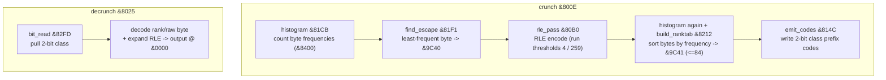

# CrunchCode — foreign SAM Coupe cruncher

Reverse-engineering notes for `CrunchCode`. Companion to the byte-exact
disassembly [`CrunchCode.asm`](./CrunchCode.asm).

> The algorithm is a **static frequency-rank entropy code + RLE** (a
> quasi-Huffman "cruncher"), **not** LZ. Load address, entry points, the decoder
> and the exact code format are recovered; the disassembly reassembles byte-exact.

---

## 1. Identification

| Property      | Value                                                       |
|---------------|-------------------------------------------------------------|
| Name          | **CrunchCode** (foreign / unknown author — no signature)    |
| Platform      | SAM Coupe (Z80, paged memory)                              |
| File size     | 782 bytes                                                   |
| Load address  | **`&8000`** (confirmed by `LD (&800C),SP` at each entry)    |
| Relation      | **NOT** part of the RUMSOFT/SAPOSOFT package (0 % shared code) |

---

## 2. Entry points

Three `JP` vectors at the load address; each disables interrupts, saves `SP` at
`&800C`, runs with `SP=0`, then restores `LMPR`/`SP` and `EI; RET`:

| Address | Name           | Action                                                       |
|---------|----------------|--------------------------------------------------------------|
| `&800E` | `crunch`       | **PACK** — `crunch_core &807F`                               |
| `&8025` | `decrunch`     | **UNPACK** — `decrunch_core &8256` (the depacker)            |
| `&803F` | `decrunch_out` | unpack, then **stream the result out via `OTDR` to port `&F8`** (after busy-waiting for status `&C0` on `&F8`), then set VMPR |

(The packer is the single `&800E` entry; `&8025` and `&803F` are both depack —
`&803F` additionally transmits the result to an external device on port `&F8`.)

---

## 3. Algorithm — RLE + frequency-rank entropy code

A two-stage **statistical** cruncher (no dictionary / LZ matches):



### 3.1 The frequency-rank code (exact)

`build_ranktab` ranks the (up to **84**) byte values by frequency into a table at
`&9C41` (`rank → byte`, saved with the compressed data); the inverse `byte → rank`
lives at `&8600`. `emit_codes` then writes each symbol as a **2-bit class prefix**
followed by index/raw bits, packed 2 bits at a time by `bit_write &81BB`:

| Class (low 2 bits) | Extra bits | Symbol | Code length |
|--------------------|-----------|--------|-------------|
| `00` | 2 index bits | rank `0..3`     | 4 bits |
| `01` | 4 index bits | rank `4..19`    | 6 bits |
| `10` | 6 index bits | rank `20..83`   | 8 bits |
| `11` | 8 raw bits   | literal byte not in the table (escape) | 10 bits |

So the most frequent bytes get 4-bit codes, rarer ones 6/8-bit, anything outside
the top-84 a 10-bit escape — a fixed 3-class quasi-Huffman code. `decrunch_core`
is the exact inverse: `bit_read &82FD` shifts 2 bits at a time out of a `D:E`
register (refilled from the stream every 4 reads), takes the class, then reads
`+4 / +20` offset index bits and looks up `&9C41[rank]` (or reads a raw byte),
while expanding the RLE tokens.

### 3.2 RLE pre-pass

`run_count &80D2` measures runs of equal bytes; `sub_80EB` emits run tokens with
two size thresholds, **4** and **`&103` (259)** (short runs → literals, longer →
`value,count[,FF]` forms). The least-frequent byte (`&9C40`) and `&FF` act as
markers so they rarely collide with data.

---

## 4. Key routines

| Address | Name            | Role                                                   |
|---------|-----------------|--------------------------------------------------------|
| `&800E/&8025/&803F` | entries | crunch / decrunch / decrunch+port-out          |
| `&807F` | `crunch_core`   | packer pipeline (RLE → rank-code)                      |
| `&80B0` | `rle_pass`      | RLE encode pass                                        |
| `&80D2` | `run_count`     | count a run of equal bytes                             |
| `&814C` | `emit_codes`    | write the 2-bit class prefix-code stream               |
| `&81BB` | `bit_write`     | write 2 bits to the output bitstream                   |
| `&81CB` | `histogram`     | count byte frequencies into `&8400`                    |
| `&81F1` | `find_escape`   | pick the least-frequent byte (`&9C40`)                 |
| `&8212` | `build_ranktab` | sort bytes by frequency → `&9C41` (≤84)                |
| `&8256` | `decrunch_core` | **depacker** — rank/RLE decode                         |
| `&82FD` | `bit_read`      | pull a 2-bit class from the bitstream                  |

---

## 5. C++ codec

A portable encoder + decoder pair implementing this algorithm is in
[`cpp/crunch_codec.h`](./cpp/crunch_codec.h) / `cpp/crunch_codec.cpp`
(`./crunch t` self-test). It does the RLE pre-pass then the exact 3-class
frequency-rank entropy code (§3.1): build a histogram, rank bytes by frequency
(most frequent = rank 0), and emit `class 0/1/2` (rank 0-3 / 4-19 / 20-83) or
`class 3` (raw escape). It round-trips with itself and on real data, and — being
the only entropy coder of the set — it compresses skewed data (text) better than
the RLE/LZ tools (e.g. ~70 % on English text vs ~100 % for the others).

```bash
cd cpp && clang++ -std=c++17 -O2 crunch_codec.cpp crunch_tool.cpp -o crunch
./crunch t                       # round-trip self-test
./crunch c file out.cc           # compress / ./crunch d out.cc back
```

The entropy-code fields match CrunchCode exactly; the RLE pre-pass and container
header are a clean equivalent (the SAM original integrates the stages with its
own in-memory layout), so byte-identical reproduction of the original output is
not claimed.

## 6. Status

* `CrunchCode.asm` is byte-exact (`z80asm -b` round-trips to the original 782 B).
* Format (§3.1) recovered from both the emitter and the depacker; C++ pair (§5)
  round-trips. Third-party code, kept separate from the RUMSOFT/SAPOSOFT suite.

---

*Disassembled with z80dasm 1.1.6 (byte-exact); cross-checked with Ghidra
(`z80:LE:16:default`, base &8000). Earlier draft mislabelled pack/unpack and the
algorithm family — corrected here per the depacker (`decrunch_core`).*
