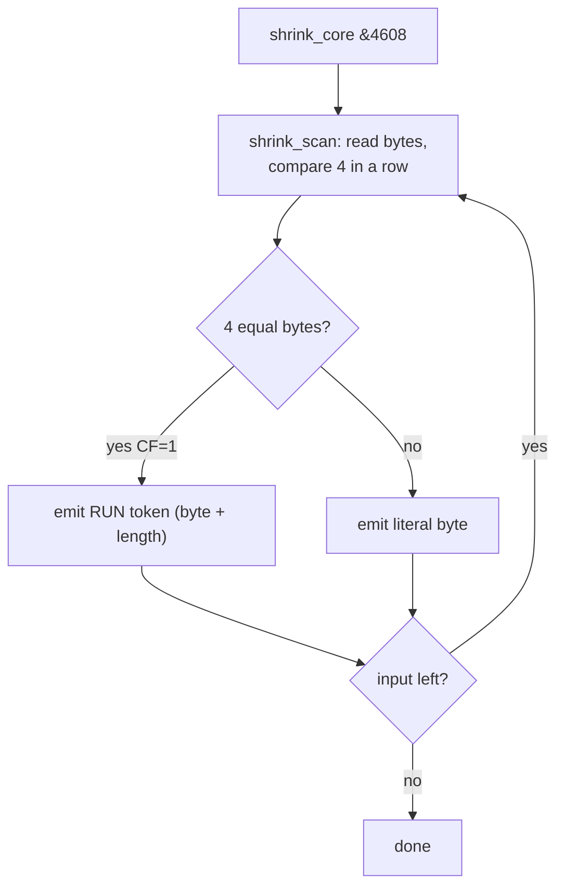
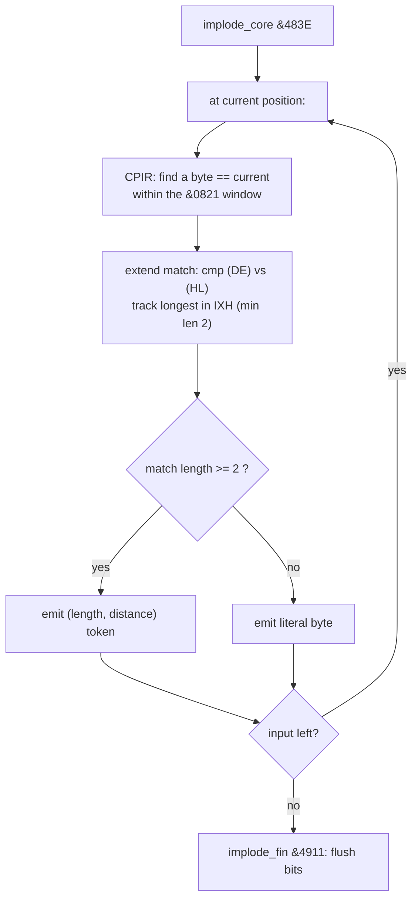
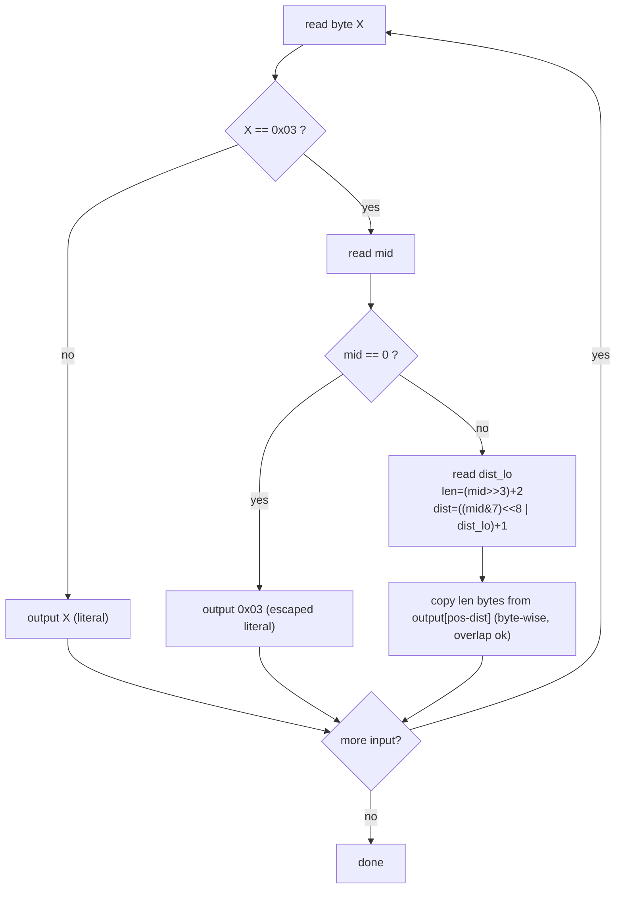
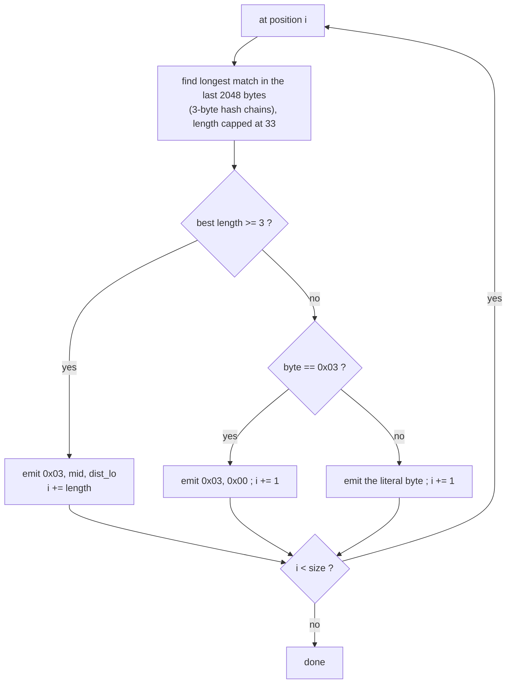

# TURBO IMPLODER V1.0 — SAM Coupe file/memory packer

Reverse-engineering notes for `IMPLO1.BIN`. Companion to the byte-exact
disassembly [`IMPLO1.asm`](./IMPLO1.asm).

> **Status: first pass.** Load address, UI, both compression algorithms and the
> `.PAK` layout are identified; the disassembly reassembles byte-exact. The exact
> token bit-layout of the emitter is characterised structurally (read `emit`
> `&49EE` / `implode_core` `&483E` in the `.asm` for the last bit-level details).

---

## 1. Identification

| Property      | Value                                                       |
|---------------|-------------------------------------------------------------|
| Name          | **TURBO IMPLODER V1.0**                                      |
| Authors       | **RUMSOFT & SAPOSOFT '93** ("Preklad: 18-10-93 Lipt. Mikuláš") |
| Platform      | SAM Coupe (Z80, paged memory)                               |
| File size     | 2576 bytes                                                  |
| Load address  | **`&4000`**, entry `&4000 → JP &43FB`                        |
| Output        | self-extracting **`.PAK`** (default `NONAME.PAK`)            |

This is the standalone packer engine. The same compression is used by
`ARCHIV.BIN`'s **F3 COMPRESS** (`f3_compress &77C5` → implode path).

---

## 2. Interface

Interactive prompts (edited on screen, then confirmed):

| Prompt   | Meaning                                              |
|----------|------------------------------------------------------|
| Start    | start address of the block to pack (default 32768)   |
| Length   | length of the block                                  |
| Call     | call/auto-start address (blank = none)               |
| Name     | output file name (default `NONAME.PAK`)              |
| Mode     | `1` shrink · `2` implode · `3` both                  |
| Speed    | 0 (best ratio) … 7 (fastest)                         |
| Skip     | reserved                                             |

Then: "Total lenght: … byte", "Save the file ? (yes)", "You are sure ? (y/n)".

`Mode` is read as ASCII `'1'..'3'` and tested **bitwise**:
`Mode & 1` runs SHRINK, `Mode & 2` runs IMPLODE — so `'3'` runs both, cascaded.

---

## 3. The two algorithms

### 3.1 SHRINK (Mode 1) — Run-Length Encoding

Wrapper `shrink &4554` → core `shrink_core &4608` → scanner `shrink_scan &4665`.

`shrink_scan` walks the source looking for a **run of ≥ 4 identical bytes**
(three `CP (HL)` comparisons in a row). When found it returns `CF=1` at the run
start; the caller emits a run token (value + count) and copies literals
otherwise. Pages are crossed by bumping HMPR (`&FB`). Fast, modest ratio — good
for screens and blocky data.

> Note: PKZIP's "Shrink" is actually LZW; RUMSOFT reused the *name* for a simple
> RLE.



**Exact SHRINK token format** (from the depacker, decode loop `l46aeh`) — a
**PackBits** variant. A control byte `B` gives `count = (B & 0x7F) + 1` (1..128):

| `B` | Token | Meaning |
|-----|-------|---------|
| bit7 = 1 | `B, value` | output `value` repeated `count` times (REPEAT) |
| bit7 = 0 | `B, b0..b(count-1)` | output the `count` following bytes verbatim (LITERAL) |

No escape byte is needed (the format is positional). `shrink_scan` triggers a
REPEAT once it sees **≥ 4** equal bytes; other bytes accumulate into LITERAL runs.
A portable C++ encoder+decoder is in [`cpp/shrink_codec.*`](./cpp/shrink_codec.h)
(`./shrink t`). (The SAM original stores it backward for in-place decode.)

### 3.2 IMPLODE (Mode 2) — LZ77 / LZSS dictionary

Wrapper `implode &476A` → core `implode_core &483E` (+ `implode_fin &4911`).

A sliding-window dictionary coder:

* `CPIR` scans the already-seen data for a byte equal to the current one — a
  **match candidate**.
* The inner loop (`l48a0h`) extends the candidate, comparing `(DE)` vs `(HL)`,
  to measure the match length.
* `IXH` keeps the **best (longest) match**; a match is emitted only when it is
  **≥ 3** bytes (length is capped at `&21` = 33).
* `BC` caps the search distance to **`&0821` = 2081 bytes** — the window size.
* The result is emitted as either a **literal** byte or a **(length, distance)**
  match token; `emit &49EE` just writes one output byte (with paging).

Slower than shrink, better ratio — this is the LZ-style method (in the spirit of
PKZIP's "Implode", which is also LZ-based). **The exact token byte format and a
C++ encoder/decoder are in §6a below.**



### 3.3 Mode 3 — both

Runs SHRINK first, then IMPLODE over the result (the wrappers are called in
sequence from the driver).

---

## 4. Output `.PAK` format

The packer emits a **self-extracting** SAM CODE file (same idea as `SKOMP1`):

* A file header is built at `&4B00` (file type `&13` = SAM CODE), carrying the
  name, length and page/offset of the target.
* A small **depacker** is relocated (to `&4C00`) and saved ahead of the
  compressed data, so running the `.PAK` restores the original block (and
  auto-starts at *Call* if one was given).
* Address ↔ (page, offset) conversion uses the usual SAM idiom (`addr_to_page
  &4702`), as in `SKOMP1`.

---

## 5. Key routines

| Address | Name           | Role                                                   |
|---------|----------------|--------------------------------------------------------|
| `&43FB` | `start`        | UI driver: read params, run compressor(s), save        |
| `&4554` | `shrink`       | SHRINK wrapper (sets paging, computes packed length)   |
| `&4608` | `shrink_core`  | SHRINK main loop                                       |
| `&4665` | `shrink_scan`  | detect a run of ≥4 equal bytes (CF=1 if found)         |
| `&476A` | `implode`      | IMPLODE wrapper                                        |
| `&483E` | `implode_core` | LZ77 longest-match search (CPIR), token emission       |
| `&4911` | `implode_fin`  | flush the bit stream                                   |
| `&49EE` | `emit`         | write to the compressed bit/byte stream                |
| `&4702` | `addr_to_page` | Z80 address → SAM (page, offset)                       |

---

## 6. Relation to the other tools

* **ARCHIV.BIN** (DISK ARCHIVE) `F3 COMPRESS` uses the same engine — its
  `f3_compress &77C5` checks `Mode & 2` and calls the implode path, mirroring
  this driver.
* **UNPAK.BIN** is the matching unpacker for archives; the per-file `.PAK`
  produced here is self-extracting on its own.
* **SKOMP1** shares the self-extracting-stub technique (embedded depacker +
  page/offset header) but is a dedicated screen RLE.

---

## 6a. Exact IMPLODE LZ77 token format

Recovered from the **depacker** (`implode_fin &4911` → the stub relocated to
`&4C00`, decode loop at `l4970h`), which decodes unambiguously. The stub decodes
**backwards in place** (input and output pointers run from the end downwards,
matches copied with `LDDR`) so a `.PAK` can unpack over itself — but the token
fields are:

| Token | Bytes | Meaning |
|-------|-------|---------|
| Literal | `b` (where `b ≠ 0x03`) | output byte `b` |
| Escaped literal | `0x03, 0x00` | output the byte `0x03` (`mid == 0` ⇒ "not a match") |
| Match | `0x03, mid, dist_lo` (`mid ≠ 0`) | copy `len` bytes from `dist` back |

Field packing of a match:

```
mid     = ((len - 2) << 3) | dist_hi      ; high 5 bits = len-2 (1..31), low 3 = dist_hi
len     = (mid >> 3) + 2                   ; 3 .. 33      (encoder caps at &21 = 33)
dist    = ((dist_hi << 8) | dist_lo) + 1   ; 1 .. 2048    (matches the &0821 window)
```

`0x03` is the only reserved byte (it is the match marker); every other byte value
is a self-representing literal. The minimum match length is 3 (the encoder only
emits a match when its longest candidate, tracked in `IXH`, exceeds 2).

> The SAM decoder's `LDDR` count is `len+1`; the extra byte reuses the slot of
> the `0x03` marker that was provisionally written — an artifact of in-place
> backward decoding. Logically the match length is `len`.

### Decode



### Encode (greedy)



### C++ implementation

A portable encoder + decoder for this exact token format lives in
[`cpp/implode_codec.h`](./cpp/implode_codec.h) / `cpp/implode_codec.cpp`, with a
self-test CLI (`cpp/implode_tool.cpp`, `./implode t`). It is a **forward** model
(clean LZ77) using the same fields, escape and length/distance ranges; it
round-trips with itself and on real data. The on-SAM original differs only in the
backward in-place arrangement; bit-identical reproduction of the original
encoder's *output* is not claimed (no packed sample was available to diff).

```bash
cd cpp && clang++ -std=c++17 -O2 implode_codec.cpp implode_tool.cpp -o implode
./implode t                      # round-trip self-test
./implode c file out.imp         # compress / ./implode d out.imp back
```

---

## 7. Next steps

1. Decode the exact bit-layout of `emit &49EE` (token formats: literal flag,
   length and distance field widths) to fully specify the stream.
2. Annotate `implode_core` line-by-line and the `.PAK` depacker stub.
3. Reverse `UNPAK.BIN` and confirm the inverse of both methods.
4. Produce the Slovak translation `IMPLO1.sk.md` once stabilised.

---

*Disassembled with z80dasm 1.1.6 (byte-exact, `make NAME=IMPLO1 verify`);
control-flow cross-checked with Ghidra (`make NAME=IMPLO1 ghidra`).*
