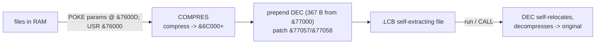

# Library v2.1 — SAM Coupe file librarian (SAM BASIC)

Notes for `Lib v21`. Companion to the detokenised listing [`Lib v21.bas`](./Lib%20v21.bas).

---

## 1. Identification

| Property   | Value                                                        |
|------------|--------------------------------------------------------------|
| Name       | **Library** v2.1 ("Library - Maker")                         |
| Author     | **S. Grodkowski, 1993** (a different author than RUMSOFT)     |
| Type       | **tokenised SAM BASIC** program (not Z80 code)               |
| File size  | 14081 bytes (154 BASIC lines ≈ 10.8 KB text + variables area) |
| Engines    | loads `COMPRES` + `DEC` (the SAPOSOFT compression pair)       |

Detokenise with `python3 sambas2txt.py "Lib v21" "Lib v21.bas"` (clean — no
unknown tokens). Boot line:

```
10000 CLEAR 44999: LOAD "COMPRES" CODE &76000: LOAD "DEC" CODE &77000: RUN
```

`&76000` is a SAM long address (page 29, offset &2000) → CPU `&A000` when paged
into section C, matching `COMPRES`'s self-store `LD (&A017),SP`.

---

## 2. What it does (per `arch-pack_utils_info.txt` + the listing)

A **librarian**: keeps many files in one "library" and (optionally) compresses
them. Main menu (key → PROC):

| Key | Action               | Key | Action                    |
|-----|----------------------|-----|---------------------------|
| a   | Add a file           | s   | Save a library file       |
| r   | Remake a library     | d   | Dir 1                     |
| c   | List files           | e   | Erase a file              |
| l   | Load a library file  | 1   | Extract one file          |
| q   | Quit                 |     |                           |

PROCs: `makelib`, `oblicz`, `filesave`, `fileload`, `filelist`, `remakelib`,
`compr`, `fileerase`, `one_file`. Key variables: `start=32768`, `ram`,
`dane=61006`, `krok=48`, `ilosc` (count), `max=80` (file limit). Library files
use extension **`.LIB`** (plain) or **`.LCB`** (compressed). `info.txt` warns one
of the (de)compression routines has a bug so some files may not restore cleanly.

---

## 3. How it drives COMPRES and DEC  (PROC `compr`, lines 1000-1120)

This BASIC is the missing link that explains the `COMPRES` and `DEC` binaries.

1. **Set COMPRES parameters** by POKEing its data block (`&7600D…&76015`, i.e.
   `COMPRES`'s `&A00D` area at run time):
   - length: `DPOKE &76013,ML : POKE &76015,NSL`  (`ML=len MOD 65536`, `NSL=len DIV 65536`)
   - source: `POKE &7600D,FRP : DPOKE &7600E,FRA`  (page, offset of FROM)
   - dest:   `POKE &76010,TOP : DPOKE &76011,TOA`  (page, offset of TO)
2. **Compress:** `LET DAT = &6C000 + USR &76000` — calls `COMPRES` (core `&A550`).
3. **Make it self-extracting:** `POKE x-367, MEM$ (&77000 TO &77000+366)` copies
   **exactly 367 bytes** — the whole **`DEC`** depacker — in front of the
   compressed data, and `POKE &77057,DEPP : DPOKE &77058,DEPA` patches `DEC`'s
   unpack-target (the self-modified slots seen in `DEC.asm`).

So a compressed library file = **`DEC` stub (367 B) + COMPRES output**, and just
running it self-decompresses. This confirms both binaries:



Decompression on load (PROC `fileload`, line 340): `LOAD b$+s$ CODE 59000: CALL
59000` runs the prepended `DEC` stub to restore the file.

---

## 4. Relation to the other tools

* `COMPRES.asm` and `DEC.asm` are **this program's engines** (SAPOSOFT /
  Grodkowski), *not* part of RUMSOFT's `ARCHIV`/`IMPLODER`. (The IMPLODER credits
  "RUMSOFT & SAPOSOFT", so the SAPOSOFT half is this compression pair.)
* Same self-extracting-stub idea as `SKOMP1` / RUMSOFT `.PAK`, but a different
  engine and a separate `DEC` depacker.

---

## 5. Status

* `Lib v21.bas` — full detokenised listing (clean, all tokens resolved).
* Drives `COMPRES.asm` (@ &A000) and `DEC.asm` (@ &8000), both byte-exact and
  now fully explained by this BASIC.
* Remaining (optional): line-level annotation of COMPRES's token format and
  DEC's decode body; Slovak summary.

---

*Detokenised with `sambas2txt.py` (token table from the SAM ROM source).*
