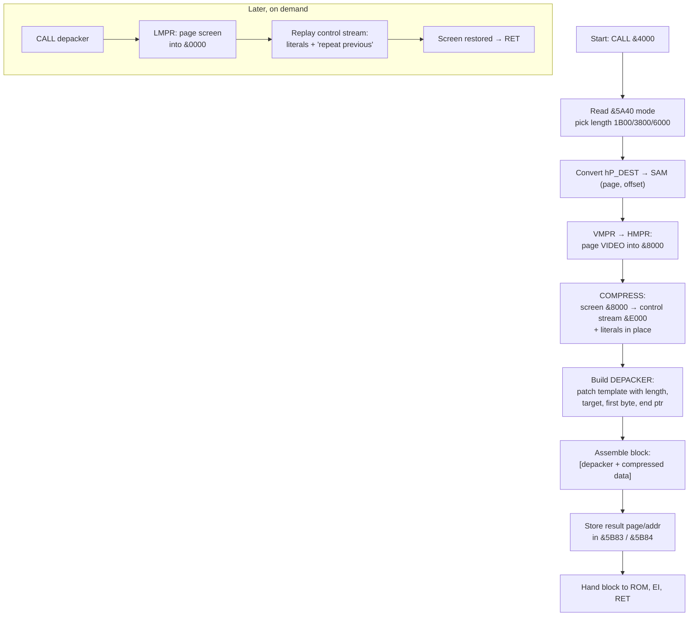
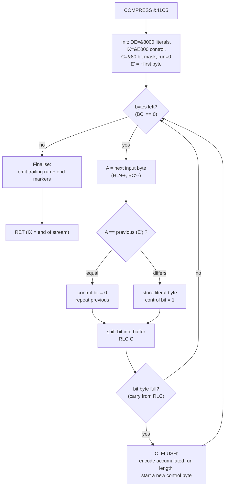
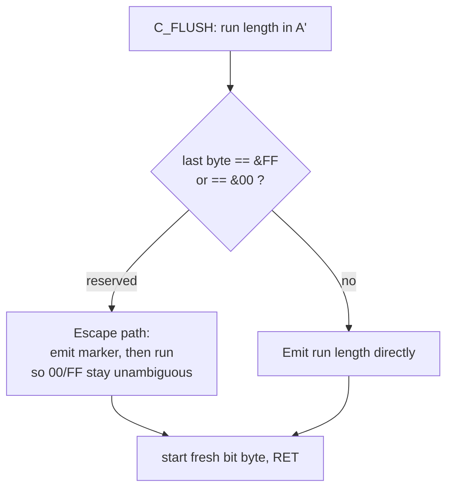
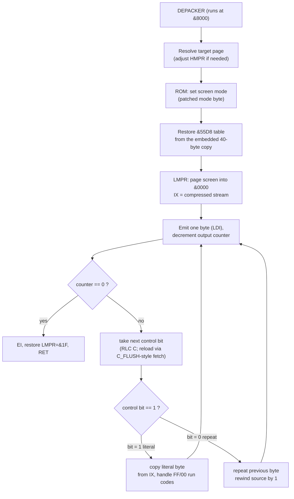

# SKOMP v2.0 — SAM Coupe Screen Compressor

Reverse-engineered documentation of `SKOMP1.BIN` (RUMSOFT, 1993).
Companion to the annotated disassembly [`SKOMP1.asm`](./SKOMP1.asm).

---

## 1. Identification

| Property        | Value                                                            |
|-----------------|-----------------------------------------------------------------|
| Name            | **SKOMP** ("skomprimovať" = *to compress*), version 2.0         |
| Author / origin | RUMSOFT; port note: *"PREKLAD: 30.09.93 ZDRAVIM RECALL SOFT"*    |
| Platform        | **SAM Coupe** (Z80, paged memory)                               |
| File size       | 678 bytes                                                        |
| Load address    | `&4000`                                                          |
| Entry point     | `&4000` → `JP &400C`                                             |
| Purpose         | Compress the **current screen** and emit a **self-extracting** block |

SKOMP is not an ordinary program but a **compression engine**. Running it
captures the current video page, compresses it, and produces a stand-alone
block `[depacker + compressed data]` that — when later `CALL`ed — restores the
picture by itself.

---

## 2. Memory map

| Range          | Size  | Contents                                                            |
|----------------|-------|--------------------------------------------------------------------|
| `&4000`        | 3 B   | `JP &400C` — entry jump                                             |
| `&4003..&400B` | 9 B   | Header / self-modified **parameter block**                         |
| `&400C..&40E8` | 221 B | **MAIN** — driver routine                                          |
| `&40E9..&40FE` | 22 B  | Text `" ***  Version 2.0 *** "`                                     |
| `&40FF..&41C4` | 198 B | **DEPACKER** template (runs relocated at `&8000`)                  |
| └ `&4196..&419C` | 7 B | `"RUMSOFT"` tag (inside the template)                              |
| └ `&419D..&41C4` | 40 B | Run-time table (copied from `&55D8`, restored on unpack)          |
| `&41C5..&427B` | 183 B | **COMPRESS** + **C_FLUSH** — the compressor (build-time only)      |
| `&427C..&42A5` | 42 B  | Author signature text                                              |

---

## 3. Interface

### 3.1 Inputs

| Source                    | Meaning                                                                                  |
|---------------------------|------------------------------------------------------------------------------------------|
| **Current video page**    | The actual data to compress. Read by paging VMPR into section C (`&8000`).               |
| `&5A40` (system variable) | **Mode selector** → chooses the data length and the screen mode for the depacker.        |
| `&4009/&400A` (`hP_DEST`) | Target address where the result block is placed (default **`&8000`**).                   |
| `&4008` (`hP_FLAG`)       | Flag / high-page seed (default `0`).                                                      |
| `&400B` (`hP_BYTE`)       | Scratch / first-byte marker for the RLE pass.                                            |

Mode → length mapping:

| `&5A40` | Length  | Decimal | Typical use                     |
|---------|---------|---------|---------------------------------|
| `0`     | `&1B00` | 6912    | Classic 256×192 screen + attrs  |
| `1`     | `&3800` | 14336   | Larger screen mode              |
| `≥2`    | `&6000` | 24576   | Full SAM mode-4 screen          |

### 3.2 Outputs

| Destination       | Meaning                                                       |
|-------------------|---------------------------------------------------------------|
| `[depacker+data]` | Self-extracting block written at the page/offset of `hP_DEST`.|
| `&5B83`           | Result **page** number.                                       |
| `&5B84/&5B85`     | Result **address**.                                           |
| `&E000+`          | Intermediate compressed stream (control bytes).               |

### 3.3 Hardware ports (SAM Coupe paging)

| Port  | Name | Role in SKOMP                                              |
|-------|------|-----------------------------------------------------------|
| `&FA` | LMPR | Page screen into section A (`&0000`) while **unpacking**.  |
| `&FB` | HMPR | Page video into section C (`&8000`) while **compressing**. |
| `&FC` | VMPR | Read the current video page number.                        |

### 3.4 Calling convention

* **Compress:** `CALL &4000` with `&5A40`, `hP_DEST`, `hP_FLAG` set. Interrupts
  are disabled internally; the result location is returned in `&5B83/&5B84`.
* **Decompress (later):** `CALL` the produced depacker block. It re-pages the
  video page, rebuilds the screen, restores the `&55D8` table, and `RET`s.

---

## 4. Data flow (high level)

---

## 5. Compression algorithm

### 5.1 Idea

SKOMP combines two classic ideas:

1. **A control bit-stream** — one bit per output byte, like the flag stream in
   an LZSS-style packer. Eight control bits are packed per byte.
2. **"Repeat previous byte" RLE** — the actual payload model. Instead of storing
   matches, the bit only says *"this byte equals the previous one"* (`0`) or
   *"this is a new literal"* (`1`). Long runs of equal bytes therefore collapse
   into runs of `0` bits, which `C_FLUSH` further encodes as **run lengths**.

The bytes `&00` and `&FF` are **reserved** in the run-length channel and are
escaped by `C_FLUSH` so a real run length can never be mistaken for an
end/separator marker.

The engine uses **both Z80 register banks** (`exx`) to keep two cursors live at
once without spilling to memory:

| Bank          | Holds                                                |
|---------------|------------------------------------------------------|
| Alt (`exx`)   | **Input** scan: `HL'` = source ptr, `BC'` = count, `E'` = previous byte |
| Main          | **Output**: `DE` = literal-out ptr, `C` = bit mask, `IX` = control-out (`&E000`) |

### 5.2 Flow

### 5.3 Run-length encoding (`C_FLUSH`)

---

## 6. Decompression algorithm

The depacker is the 198-byte template relocated to `&8000`. MAIN patches five
immediates into it before saving:

| Patched at (run-time) | Value                        |
|-----------------------|------------------------------|
| `&8013`               | screen **mode** (from `&5A40`) |
| `&803B`               | end pointer of the data      |
| `&8042`               | data **length**              |
| `&804B`               | **first** decompressed byte  |
| `&805A`               | loop `JP` target             |

### 6.1 Flow

### 6.2 Literal vs run handling

* Control bit `1` → take the next **literal** from the stream. The values `&FF`
  and `&00` switch into a **run sub-mode**: the following byte is a run length,
  and the previous literal is replayed that many times.
* Control bit `0` → simply re-emit the **previous** byte (the cheapest case,
  costing a single bit).

This is symmetric to the compressor: equal bytes cost ~1 bit, changing bytes
cost one byte plus one bit, and long equal runs cost ~1 byte of length.

---

## 7. About the compression scheme & where similar ones are used

### 7.1 What class is it?

SKOMP is a **byte-oriented RLE with a separate control-bit stream**. Two
well-known building blocks are fused:

* **Run-Length Encoding (RLE)** of *equal-to-previous* bytes — i.e. a
  **delta/previous-byte predictor** whose residual ("same / different") is then
  run-length coded. Screen data (large flat areas, repeated attribute bytes) is
  exactly what this exploits.
* **Bit-flag framing** — one flag bit per token deciding *literal vs. repeat*.
  This is the framing used by **LZSS** (and the LZ77 family in general), where
  the flag distinguishes a literal from a back-reference. SKOMP keeps the
  framing but replaces the back-reference with the much simpler "repeat
  previous" rule, so it is **RLE, not LZ** — but packaged LZSS-style.

It is *not* an entropy coder (no Huffman/arithmetic) and *not* a dictionary
coder (no match offsets/lengths). It is fast, tiny, and decompresses in a single
linear pass — ideal for an 8-bit machine restoring a screen in real time.

### 7.2 Reserved-value escaping

Reserving `&00`/`&FF` as in-band markers and escaping them is the same trick
used by many byte-stream formats to keep control codes unambiguous (e.g. byte
stuffing in HDLC/PPP, `0xFF` stuffing in JPEG entropy data, COBOL/COBS framing).

### 7.3 Who/where uses similar algorithms

| Scheme / product                          | Relation to SKOMP                                              |
|-------------------------------------------|---------------------------------------------------------------|
| **PackBits** (Apple → TIFF, MacPaint)     | Almost the same: a control code chooses *copy N literals* vs *repeat 1 byte N times*. Closest mainstream relative. |
| **PCX (ZSoft)**, **BMP RLE4/RLE8**, **TGA RLE** | Image RLE with run/literal runs — same family for raster data. |
| **IFF/ILBM ByteRun1** (Amiga)             | Identical PackBits encoding for bitplanes.                     |
| **Fax Group 3/4 (T.4/T.6)**               | Run-length coding of scan lines (with entropy coding on top).  |
| **LZSS / LZ77 packers** (ZIP, LZ4 tokens) | Share the **1-flag-bit-per-token** literal/copy framing.       |
| **8-bit demoscene screen packers**        | ZX Spectrum / SAM / C64 tools used exactly this "previous-byte RLE + bit stream" pattern for `SCR`/screen blobs. |
| **PCM/audio delta-RLE, MNP-5, V.42bis RLE**| "Predict then run-length the repeats" is the shared principle. |

### 7.4 Trade-offs

* **Pros:** tiny code (≈380 bytes engine + 198-byte self-extractor), very fast,
  one-pass decode, no tables, excellent on flat/striped screen data.
* **Cons:** only ~1-bit modelling per byte; no cross-distance matches, so
  dithered/noisy images compress poorly compared to LZ or entropy coders.

---

## 8. Notes & caveats

* The code is heavily **self-modifying** and bank-switched; a linear
  disassembler flags both. The accompanying `.asm` is byte-exact: it reassembles
  (`z80asm -b`) back to the original `SKOMP1.BIN`.
* Exact bit-level details of the `C_FLUSH` run encoding (escape ordering for the
  reserved `&00`/`&FF` values) are described structurally above; the precise
  numeric encoding is best read directly from `COMPRESS`/`C_FLUSH` in the `.asm`.
* All addresses use the SAM convention `&XXXX` (hex).

---

*Generated from a reverse-engineering session (z80dasm 1.1.6 + manual analysis).*
