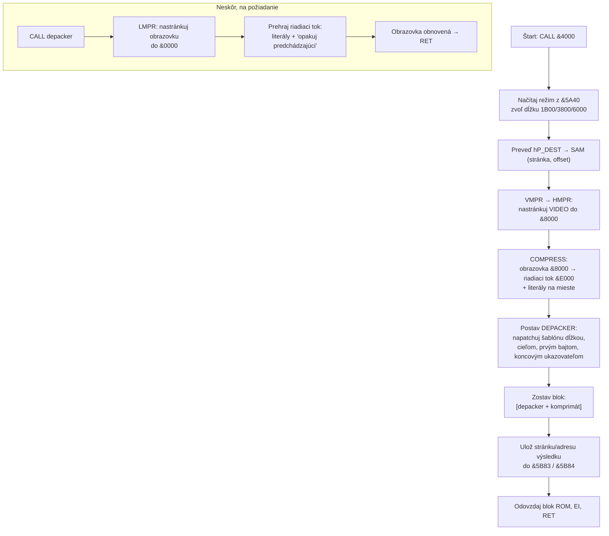
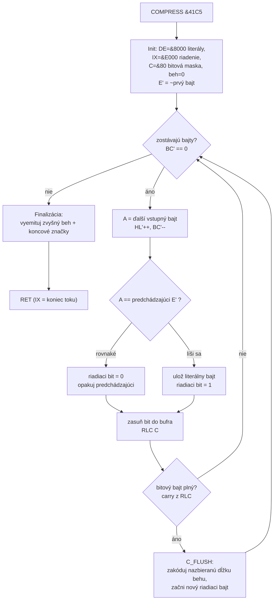
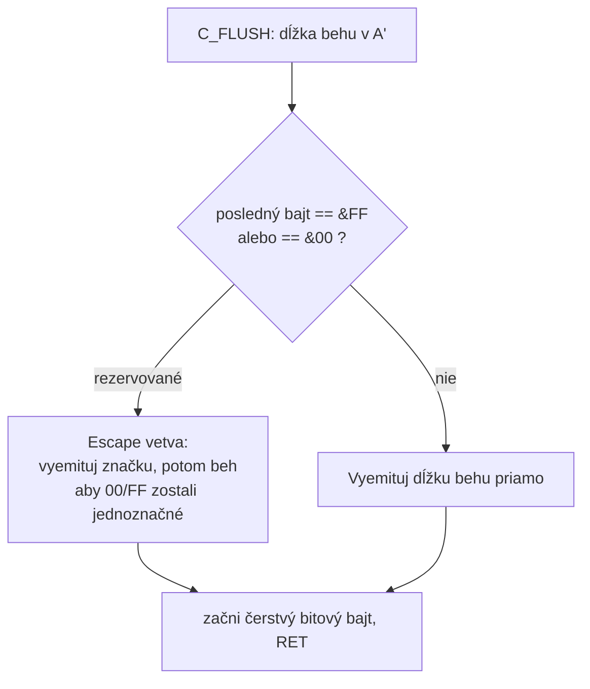
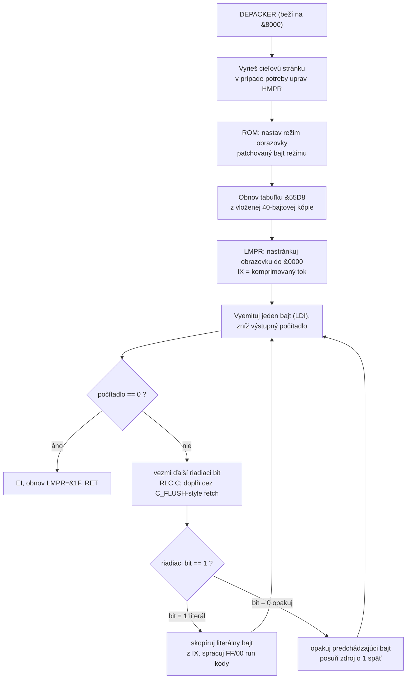

# SKOMP v2.0 — kompresor obrazovky pre SAM Coupe

Spätne zrekonštruovaná dokumentácia súboru `SKOMP1.BIN` (RUMSOFT, 1993).
Slovenská verzia anglického dokumentu [`SKOMP1.md`](./SKOMP1.md).
Sprievodca k anotovanému disassembly [`SKOMP1.asm`](./SKOMP1.asm).

---

## 1. Identifikácia

| Vlastnosť        | Hodnota                                                          |
|------------------|-----------------------------------------------------------------|
| Názov            | **SKOMP** („skomprimovať"), verzia 2.0                          |
| Autor / pôvod    | RUMSOFT; poznámka o porte: *„PREKLAD: 30.09.93 ZDRAVIM RECALL SOFT"* |
| Platforma        | **SAM Coupe** (Z80, stránkovaná pamäť)                          |
| Veľkosť súboru   | 678 bajtov                                                       |
| Load adresa      | `&4000`                                                          |
| Vstupný bod      | `&4000` → `JP &400C`                                             |
| Účel             | Skomprimovať **aktuálnu obrazovku** a vytvoriť **samorozbaľovací** blok |

SKOMP nie je bežný program, ale **kompresný engine**. Po spustení zachytí
aktuálnu video stránku, skomprimuje ju a vytvorí samostatný blok
`[depacker + komprimát]`, ktorý — keď ho neskôr `CALL`-neš — sám obnoví obraz.

---

## 2. Pamäťová mapa

| Rozsah         | Veľkosť | Obsah                                                            |
|----------------|---------|-----------------------------------------------------------------|
| `&4000`        | 3 B     | `JP &400C` — vstupný skok                                        |
| `&4003..&400B` | 9 B     | Hlavička / self-modifikovaný **blok parametrov**                 |
| `&400C..&40E8` | 221 B   | **MAIN** — riadiaca rutina                                       |
| `&40E9..&40FE` | 22 B    | Text `" ***  Version 2.0 *** "`                                  |
| `&40FF..&41C4` | 198 B   | Šablóna **DEPACKER** (beží presunutá na `&8000`)                 |
| └ `&4196..&419C` | 7 B   | Značka `"RUMSOFT"` (vnútri šablóny)                              |
| └ `&419D..&41C4` | 40 B  | Run-time tabuľka (kopíruje sa z `&55D8`, pri rozbalení obnoví)   |
| `&41C5..&427B` | 183 B   | **COMPRESS** + **C_FLUSH** — kompresor (len pri balení)         |
| `&427C..&42A5` | 42 B    | Text podpisu autora                                              |

---

## 3. Rozhranie

### 3.1 Vstupy

| Zdroj                     | Význam                                                                                   |
|---------------------------|------------------------------------------------------------------------------------------|
| **Aktuálna video stránka**| Samotné dáta na kompresiu. Čítané po nastránkovaní VMPR do sekcie C (`&8000`).           |
| `&5A40` (systémová premenná) | **Voľba režimu** → určuje dĺžku dát a režim obrazovky pre depacker.                    |
| `&4009/&400A` (`hP_DEST`) | Cieľová adresa, kam sa uloží výsledný blok (default **`&8000`**).                        |
| `&4008` (`hP_FLAG`)       | Príznak / seed horných bitov stránky (default `0`).                                      |
| `&400B` (`hP_BYTE`)       | Pracovný / štartovací bajt pre RLE prechod.                                              |

Mapovanie režim → dĺžka:

| `&5A40` | Dĺžka   | Decimálne | Typické použitie                |
|---------|---------|-----------|---------------------------------|
| `0`     | `&1B00` | 6912      | Klasická obrazovka 256×192 + atribúty |
| `1`     | `&3800` | 14336     | Väčší obrazovkový režim         |
| `≥2`    | `&6000` | 24576     | Plná obrazovka SAM mode 4       |

### 3.2 Výstupy

| Cieľ              | Význam                                                          |
|-------------------|----------------------------------------------------------------|
| `[depacker+dáta]` | Samorozbaľovací blok zapísaný na stránku/offset podľa `hP_DEST`.|
| `&5B83`           | Číslo výslednej **stránky**.                                    |
| `&5B84/&5B85`     | Výsledná **adresa**.                                            |
| `&E000+`          | Medzivýsledok — komprimovaný riadiaci tok (control bajty).      |

### 3.3 Hardvérové porty (stránkovanie SAM Coupe)

| Port  | Názov | Úloha v SKOMP                                              |
|-------|-------|-----------------------------------------------------------|
| `&FA` | LMPR  | Nastránkuje obrazovku do sekcie A (`&0000`) počas **rozbaľovania**. |
| `&FB` | HMPR  | Nastránkuje video do sekcie C (`&8000`) počas **kompresie**. |
| `&FC` | VMPR  | Načíta číslo aktuálnej video stránky.                      |

### 3.4 Volacia konvencia

* **Kompresia:** `CALL &4000` s nastaveným `&5A40`, `hP_DEST`, `hP_FLAG`.
  Prerušenia sa interne zakážu; umiestnenie výsledku sa vráti v `&5B83/&5B84`.
* **Dekompresia (neskôr):** `CALL` na vytvorený blok depackera. Ten si
  nastránkuje video, obnoví obrazovku, obnoví tabuľku `&55D8` a urobí `RET`.

---

## 4. Tok dát (vysoká úroveň)

---

## 5. Kompresný algoritmus

### 5.1 Princíp

SKOMP kombinuje dve klasické myšlienky:

1. **Riadiaci bitový tok** — jeden bit na výstupný bajt, ako stream príznakov
   v packeri typu LZSS. Osem riadiacich bitov je zbalených do jedného bajtu.
2. **RLE „opakuj predchádzajúci bajt"** — samotný model dát. Namiesto ukladania
   zhôd bit len hovorí *„tento bajt je rovnaký ako predchádzajúci"* (`0`) alebo
   *„toto je nový literál"* (`1`). Dlhé behy rovnakých bajtov tak skolabujú na
   behy `0` bitov, ktoré `C_FLUSH` ďalej kóduje ako **dĺžky behov**.

Bajty `&00` a `&FF` sú v kanáli dĺžok behov **rezervované** a `C_FLUSH` ich
escapuje, takže skutočnú dĺžku behu nemožno zameniť s koncovou/oddeľovacou
značkou.

Engine používa **obe registrové banky** Z80 (`exx`), aby mal naraz dva živé
kurzory bez odkladania do pamäte:

| Banka         | Drží                                                 |
|---------------|------------------------------------------------------|
| Alt (`exx`)   | **Vstup** (scan): `HL'` = ukazovateľ zdroja, `BC'` = počet, `E'` = predchádzajúci bajt |
| Hlavná        | **Výstup**: `DE` = ukazovateľ literálov, `C` = bitová maska, `IX` = výstup riadenia (`&E000`) |

### 5.2 Tok

### 5.3 Kódovanie dĺžky behu (`C_FLUSH`)

---

## 6. Dekompresný algoritmus

Depacker je 198-bajtová šablóna presunutá na `&8000`. MAIN do nej pred uložením
napatchuje päť hodnôt (immediates):

| Patchované na (run-time) | Hodnota                       |
|--------------------------|-------------------------------|
| `&8013`                  | **režim** obrazovky (z `&5A40`) |
| `&803B`                  | koncový ukazovateľ dát        |
| `&8042`                  | **dĺžka** dát                 |
| `&804B`                  | **prvý** dekomprimovaný bajt  |
| `&805A`                  | cieľ `JP` slučky              |

### 6.1 Tok

### 6.2 Spracovanie literál vs. beh

* Riadiaci bit `1` → vezmi ďalší **literál** z toku. Hodnoty `&FF` a `&00`
  prepnú do **pod-režimu behu**: nasledujúci bajt je dĺžka behu a predchádzajúci
  literál sa zopakuje toľkokrát.
* Riadiaci bit `0` → jednoducho znova vyemituj **predchádzajúci** bajt
  (najlacnejší prípad, stojí jediný bit).

Je to symetrické ku kompresoru: rovnaké bajty stoja ~1 bit, meniace sa bajty
stoja jeden bajt plus jeden bit a dlhé rovnaké behy stoja ~1 bajt dĺžky.

---

## 7. O kompresnej schéme a kde sa podobné používa

### 7.1 Do akej triedy patrí?

SKOMP je **bajtovo orientované RLE s oddeleným riadiacim bitovým tokom**.
Splývajú v ňom dva známe stavebné prvky:

* **Run-Length Encoding (RLE)** bajtov *rovnakých ako predchádzajúci* — teda
  **delta / prediktor predchádzajúceho bajtu**, ktorého rezíduum
  („rovnaké / iné") je následne run-length kódované. Práve toto využívajú
  obrazovkové dáta (veľké jednoliate plochy, opakujúce sa atribútové bajty).
* **Rámcovanie príznakovým bitom** — jeden príznakový bit na token rozhodujúci
  *literál vs. opakovanie*. Toto je rámcovanie používané v **LZSS** (a vo
  všeobecnosti v rodine LZ77), kde príznak odlišuje literál od spätnej
  referencie. SKOMP si rámcovanie ponecháva, ale spätnú referenciu nahrádza
  oveľa jednoduchším pravidlom „opakuj predchádzajúci", takže ide o **RLE, nie
  LZ** — ale zabalené v štýle LZSS.

*Nie* je to entropický kóder (žiadny Huffman/aritmetické kódovanie) a *nie* je
to slovníkový kóder (žiadne offsety/dĺžky zhôd). Je rýchly, drobný a
dekomprimuje v jedinom lineárnom prechode — ideálny na 8-bitový stroj
obnovujúci obrazovku v reálnom čase.

### 7.2 Escapovanie rezervovaných hodnôt

Rezervovanie `&00`/`&FF` ako in-band značiek a ich escapovanie je rovnaký trik,
aký používa mnoho bajtových formátov na zachovanie jednoznačnosti riadiacich
kódov (napr. byte stuffing v HDLC/PPP, `0xFF` stuffing v JPEG entropických
dátach, COBS rámcovanie).

### 7.3 Kto/kde používa podobné algoritmy

| Schéma / produkt                          | Vzťah ku SKOMP                                                |
|-------------------------------------------|--------------------------------------------------------------|
| **PackBits** (Apple → TIFF, MacPaint)     | Takmer to isté: riadiaci kód volí *skopíruj N literálov* vs. *opakuj 1 bajt N-krát*. Najbližší mainstreamový príbuzný. |
| **PCX (ZSoft)**, **BMP RLE4/RLE8**, **TGA RLE** | Obrazové RLE s behmi/literálmi — tá istá rodina pre rastrové dáta. |
| **IFF/ILBM ByteRun1** (Amiga)             | Identické PackBits kódovanie pre bitové roviny.              |
| **Fax Group 3/4 (T.4/T.6)**               | Run-length kódovanie riadkov (s entropickým kódovaním navrch). |
| **LZSS / LZ77 packery** (ZIP, LZ4 tokeny) | Zdieľajú rámcovanie **1 príznakový bit na token** literál/kópia. |
| **8-bit demoscene screen packery**        | Nástroje pre ZX Spectrum / SAM / C64 používali presne tento vzor „RLE predchádzajúceho bajtu + bitový tok" pre `SCR`/screen bloby. |
| **PCM/audio delta-RLE, MNP-5, V.42bis RLE**| „Predikuj, potom run-length kóduj opakovania" je zdieľaný princíp. |

### 7.4 Kompromisy

* **Plusy:** drobný kód (≈380 bajtov engine + 198-bajtový samorozbaľovač),
  veľmi rýchly, jednoprechodová dekompresia, žiadne tabuľky, výborný na
  jednoliatych/pruhovaných obrazovkových dátach.
* **Mínusy:** modelovanie len ~1 bit na bajt; žiadne zhody na vzdialenosť, takže
  ditherované/zašumené obrázky komprimuje slabo v porovnaní s LZ alebo
  entropickými kódermi.

---

## 8. Poznámky a upozornenia

* Kód je silne **self-modifying** a prepína banky; lineárny disassembler na oboje
  upozorní. Priložený `.asm` je bajt-presný: reassembluje sa (`z80asm -b`) späť
  na originál `SKOMP1.BIN`.
* Presné bitové detaily run kódovania v `C_FLUSH` (poradie escapovania
  rezervovaných hodnôt `&00`/`&FF`) sú vyššie opísané štruktúrne; presné číselné
  kódovanie je najlepšie čítať priamo z `COMPRESS`/`C_FLUSH` v `.asm`.
* Všetky adresy používajú konvenciu SAM `&XXXX` (hex).

---

*Vytvorené počas spätno-inžinierskej relácie (z80dasm 1.1.6 + manuálna analýza).*
