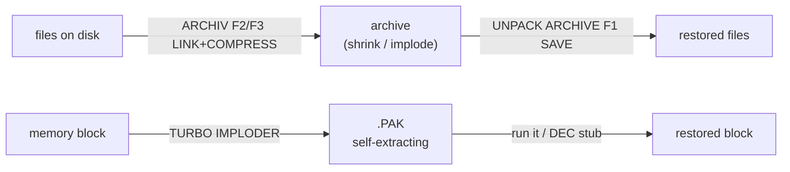
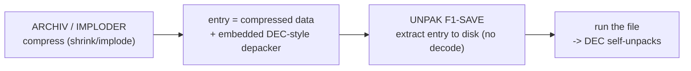

# UNPACK ARCHIVE 2.0 — SAM Coupe archive extractor

Reverse-engineering notes for `UNPAK .BIN` (note the space in the file name).
Companion to the byte-exact disassembly [`UNPAK.asm`](./UNPAK.asm).

> **Status: first pass.** Identification, UI and all text are identified and the
> disassembly reassembles byte-exact. The per-file decode loop (inverse of
> shrink/implode) is the next deep-dive — see [`IMPLO1.md`](./IMPLO1.md) for the
> forward algorithms and [`DEC`](#related) for the standalone depacker stub.

---

## 1. Identification

| Property      | Value                                                  |
|---------------|--------------------------------------------------------|
| Name          | **UNPACK ARCHIVE 2.0**                                  |
| Author        | Marian Krivoš (RUMSOFT), 1993                          |
| Platform      | SAM Coupe (Z80)                                        |
| File size     | 2154 bytes                                             |
| Load address  | **`&4100`**, entry `&4100 → JP &414D` (2nd vector `JP &484E`) |
| Role          | inverse of `ARCHIV.BIN` — extract files from an archive |

---

## 2. Interface

Menu-driven (cursor to move, RETURN to select), per `arch-pack_utils_info.txt`:

| Key | Action                          |
|-----|---------------------------------|
| F1  | SAVE — save selected files      |
| F2  | EXIT                            |
| F3  | ALL — select all                |
| F4  | NONE — unselect all             |
| F5  | INVERSE — invert the selection  |

Status line: "FILES :   SELECTED :". Prompt: "Put DESTINATION disk". Same credits
block as ARCHIV ("RUMSOFT ARCHIVE SYSTEM 2.0 / Marian KRIVOS … Slovakia").

Text is printed inline: `CALL print_inline (&45A4)` + string + `&FF`, with `&16
row col` AT codes embedded — identical convention to ARCHIV's `&734D`.

---

## 3. Role in the tool-chain

* **ARCHIV.BIN** builds a multi-file archive (compresses with shrink/implode).
* **UNPAK** is its extractor: load archive → select → **F1 SAVE** writes the
  files back, decompressing them (the inverse of `IMPLO1.BIN`'s methods).
* **DEC** is the standalone self-relocating depacker stub used by single `.PAK`
  files (see below); **COMPRES** is a separate compressor engine.

## 4. Related component binaries

### DEC (367 B, loads at `&4000`) — standalone depacker stub
A position-independent **decompressor**: it uses the `CALL`/`POP HL` trick to
discover its own run-time address, relocates ~303 bytes to `&4000`, derives the
target page from HMPR (`&FB`), and jumps in to rebuild the original block. This
is the inverse of the IMPLODER methods — the runtime unpacker that a
self-extracting `.PAK` carries.

### COMPRES (1834 B, loads at `&A000`) — compressor engine
`DI` → saves SP and VMPR → `JP &A023` → `CALL &A550` (main) → restore VMPR/LMPR →
`RET`. The core at `&A550` builds working tables and writes a bit/byte stream
(emitters at `&A02B`/`&A056`/`&A06E`) — a full compressor that produces packed
output. (Whether it is the engine ARCHIV pages in, or a standalone memory/screen
packer, is the next thing to confirm.)

---

## 5. Finding — UNPAK does not decompress inline

Searched: UNPAK contains only 2× `LDIR` (block moves) and **no `CPIR`/`LDDR`**,
i.e. no LZ/RLE decode loop. UNPAK is a **UI + disk-I/O extractor**: it lists the
archive, lets you select, and writes the chosen entries out as **self-extracting
files**. The actual decompression is deferred to **run time**, performed by each
file's embedded depacker (the **DEC** family, see §4 / `DEC.asm`).

So the full chain is:

## 6. Status & next steps

* `DEC.asm` (@ &8000) and `COMPRES.asm` (@ &A000) are now byte-exact with doc
  headers (confirmed distinct code, not duplicates).
* Remaining: line-level annotation of DEC's decode body and COMPRES's token
  format; Slovak translation once stabilised.

---

*Disassembled with z80dasm 1.1.6; byte-exact (`z80asm -b` reassembles to the
original 2154-byte file).*
